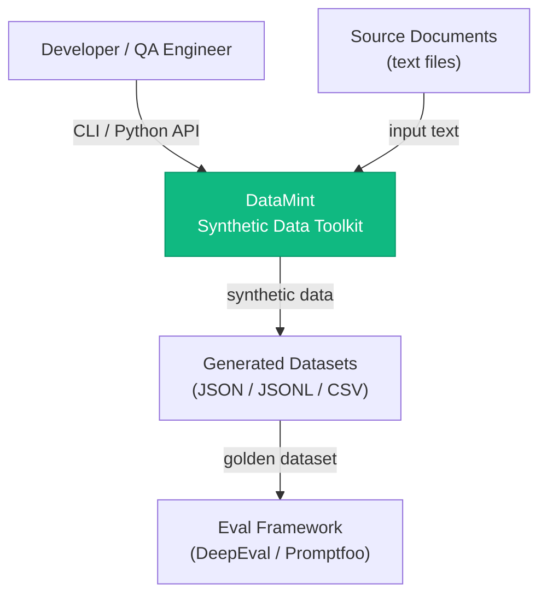
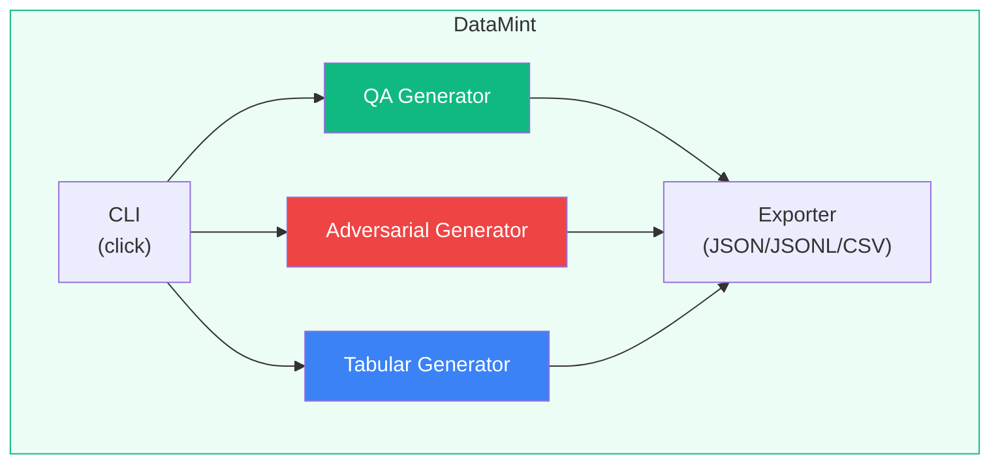
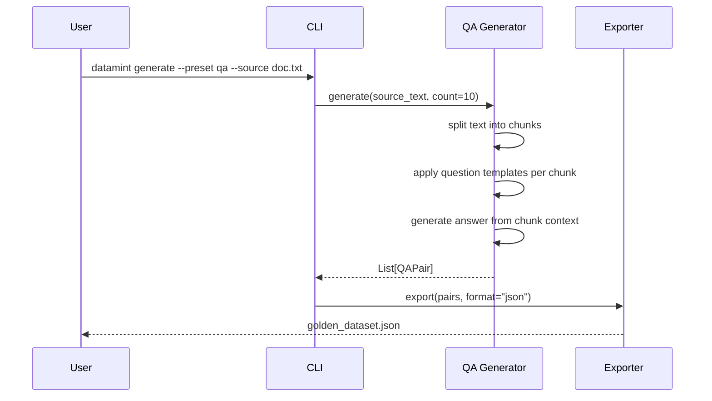

# DataMint Architecture

## Overview

DataMint is a synthetic data generation toolkit focused on two use cases: (1) generating "golden datasets" for LLM evaluation, and (2) generating adversarial prompts for red-teaming. It uses template-based generation and statistical methods — no LLM required.

## C4 Diagrams

### Level 1: System Context

### Level 2: Container Diagram

### Sequence Diagram: QA Generation

## Design Decisions

### Template-based vs. LLM-based Generation

**Chose:** Template-based question generation with algorithmic answer extraction.

**Why:** Zero external dependencies, reproducible output, works offline. An LLM-powered mode can be added as an optional enhancement.

**Tradeoff:** Lower diversity and naturalness compared to LLM-generated data. Sufficient for automated eval pipelines where consistency matters more than creativity.

### Adversarial Prompt Categories

Categories are based on OWASP LLM Top 10 and common red-teaming taxonomies. Templates are parameterized and composable, allowing combinatorial generation.

## Extension Points

1. Custom question templates via config
2. Custom adversarial prompt categories
3. Plugin system for LLM-backed generation (roadmap)
4. HuggingFace Dataset export format (roadmap)
